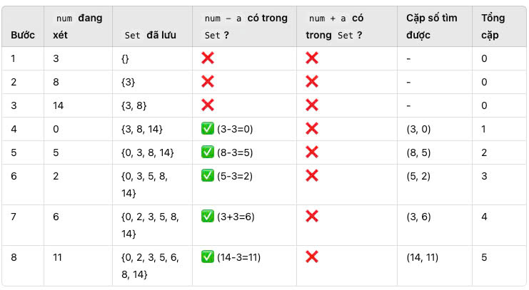

/**
 * Input:
 * Cho một array chứa các số nguyên riêng biệt và một số nguyên a xác định
 * 
 * Output:
 * Tìm ra các cặp số trong mảng có hiệu đúng bằng a
 * 
 * Exam:
 * arr = [3, 8, 14, 0, 5, 2, 6, 11]
 * a = 3
 * => Output: 6
 * (3, 0), (3,6), (8,5), (8,11), (14, 11), (5, 2)
 */

const arr = [3, 8, 14, 0, 5, 2, 6, 11];
const a = 3;

/** Cách đơn giản nhất */

const countPairsWithDifference1 = (arr, a) => {
    let output = [];
    for(i = 0; i < arr.length - 1; i++){
        for(j = i + 1; j < arr.length; j++){
          const diff = arr[j] - arr[i];
          if(Math.abs(diff) === Math.abs(del)){
            output = [...output, [arr[i], arr[j]]]
          }
        }
    }
    console.log(output)
}

/** Cách tối ưu hơn */
/**
 * Bước thực hiện
 * Tạo một Set để lưu các số đã duyệt trước đó.
 * Mục đích: Kiểm tra nhanh xem liệu có số nào đã xuất hiện trước mà tạo thành hiệu đúng bằng a. 
 * Duyệt từng phần tử trong mảng. Với mỗi số num đang xét, ta kiểm tra xem:
 * Số num - a có tồn tại trong Set không? → Nếu có, thì cặp (num - a, num) có hiệu đúng bằng a, in ra và tăng biến đếm.
 * Số num + a có tồn tại trong Set không? → Nếu có, thì cặp (num, num + a) có hiệu đúng bằng a, in ra và tăng biến đếm.
 * Thêm số num vào Set để sử dụng cho lần lặp sau.
 */

function countPairsWithDifference(arr, a) {
    let seen = new Set();  // Set để lưu các số đã duyệt
    let count = 0;  // Biến đếm số cặp thỏa mãn

    for (let num of arr) {
        if (seen.has(num - a)) {
            count++;
            console.log(`(${num - a}, ${num})`);
        }
        if (seen.has(num + a)) {
            count++;
            console.log(`(${num}, ${num + a})`);
        }
        seen.add(num);  // Thêm số hiện tại vào Set
    }

    return count;
}

console.log("Total pairs:", countPairsWithDifference(arr, a));

/**
 * Giải thích
 * Mảng này có 8 phần tử. Chúng ta sẽ duyệt từng số và dùng Set để kiểm tra hiệu
 */

 

  

